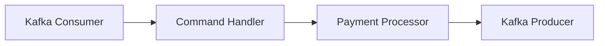

# 💳 Payment Service

Микросервис для обработки платежных транзакций с использованием Kafka и Spring Boot 3. 🚀

## 🛠 Технологии

- **Java 21** 
- **Spring Boot 3.0+**
- **Apache Kafka** 📊
- **PostgreSQL** 🗄
- **Liquibase** (миграции)
- **MapStruct** (маппинг)
- **Lombok**
- **OpenAPI 3** (Swagger)

## 📋 Функциональности

- ✅ Создание банковских счетов
- ✅ Обработка платежных транзакций
- ✅ Возвраты средств (Refund)
- ✅ Асинхронная обработка команд через Kafka
- ✅ Валидация операций
- ✅ REST API для запросов

## 🚀 Запуск проекта

### Предварительные требования
- Java 21
- PostgreSQL
- Kafka (с созданными топиками)
- Maven

### Конфигурация

1. Настройте базу данных в `application.yml`:
```yaml
spring:
  datasource:
    url: jdbc:postgresql://localhost:5432/payment_db
    username: postgres
    password: postgres
```

2. Настройте Kafka:
```yaml
spring:
  kafka:
    bootstrapServers:
      - localhost:9092
```

3. Создайте топики Kafka:
```bash
kafka-topics --create --topic payment-command --partitions 1 --replication-factor 1
kafka-topics --create --topic payment-command-result --partitions 1 --replication-factor 1
```

### Сборка и запуск
```bash
mvn clean install
mvn spring-boot:run
```

## 📡 API Endpoints

### Банковские счета
- `GET /api/v1/accounts/{accountId}` - Получить информацию о счете 🏦
- `POST /api/v1/accounts` - Создать новый счет

### Платежные транзакции
- `GET /api/v1/transactions/{transactionId}` - Получить информацию о транзакции 💸

## 🔧 Архитектура

### Компоненты обработки команд


### Модели данных
- `BankAccount` - Банковский счет
- `PaymentTransaction` - Платежная транзакция
- `Refund` - Возврат средств

## 🎯 Команды Kafka

### Отправка команд
```java
// Пример заголовков сообщения
headers:
- command: CREATE
- key: requestId
```

### Поддерживаемые команды:
- `CREATE` - Создание транзакции
- `REFUND` - Возврат средств

## 📝 Примеры запросов

### Создание счета
```curl
POST /api/v1/accounts
{
  "customerId": 123,
  "number": "ACC123456",
  "balance": 1000.00,
  "currency": "USD"
}
```

## 🧪 Тестирование

Для тестирования используйте:
```bash
mvn test
```

## 📊 Мониторинг

Сервис предоставляет:
- Логирование операций 📝
- Трассировку транзакций
- Обработку ошибок

## 🤝 Contributing

1. Форкните репозиторий
2. Создайте feature ветку
3. Коммитьте изменения
4. Пушите в ветку
5. Создайте Pull Request

---

## 📄 Лицензия

Этот проект создан в учебных целях.
